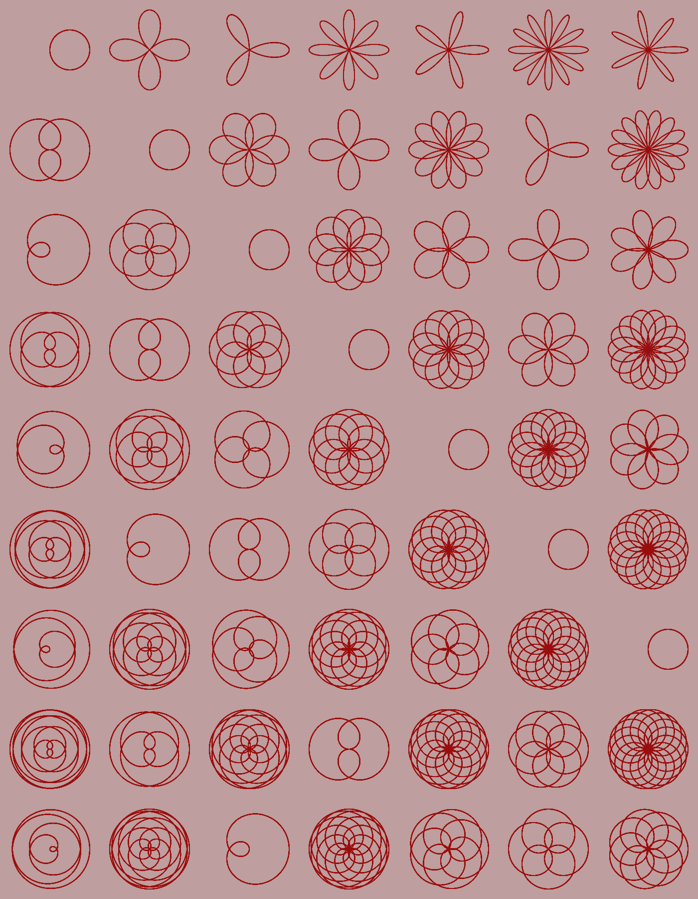
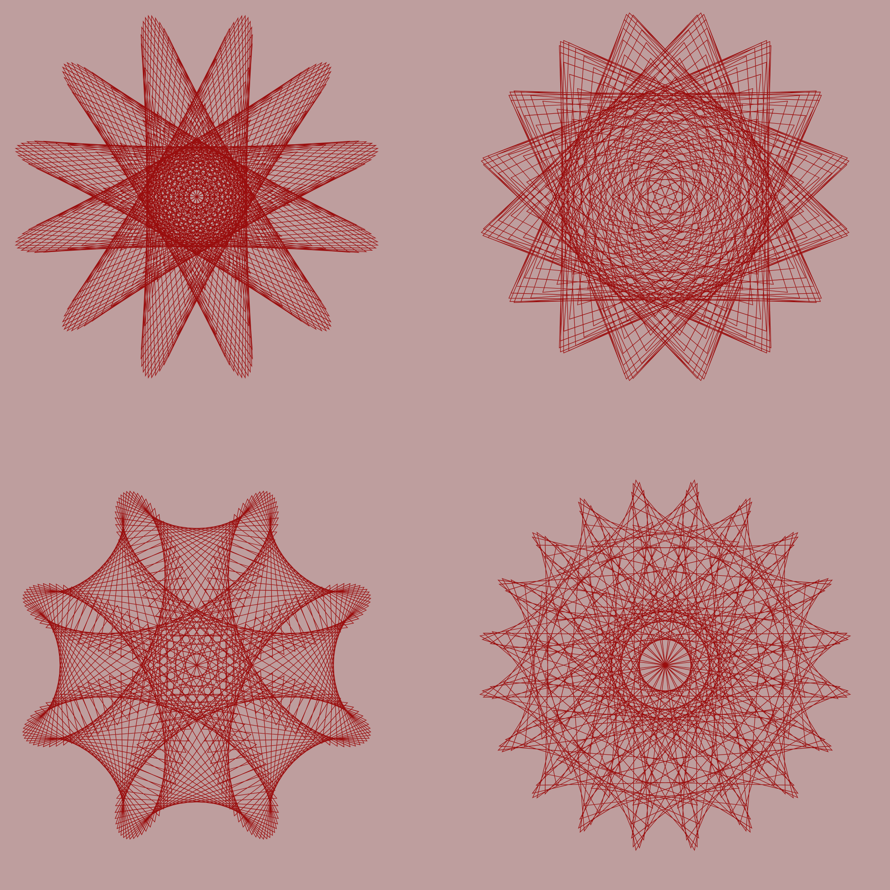
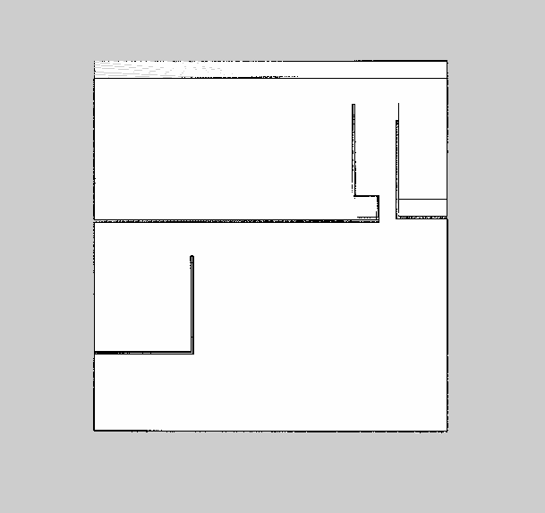
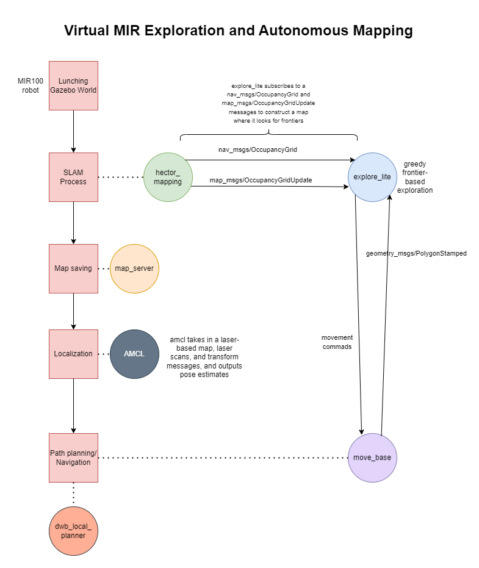

# university

## About

Some of the smaller projects/tasks realized during AI Bachelor programme at PUT University in Poznan & Applied Informatics at Klagenfurt University.

# Contents

1.  [INI parser](#ini-parser)
2.  [BMP parser](#bmp-parser)
3.  [Sorting algorithms](#sorting-algorithms)
4.  [BST, BBST and Linked Lists](#trees)
5.  [Mathematical roses in JavaScript](#mathematical-roses)
6.  [Maurer roses in JavaScript](#maurer-rose)
7.  [LERP game](#lerp-game)
8.  [MiR100 robot & SLAM algorithm](#slam-robot)
9.  [Wildlife simulator: preys & predators](#wildlife-simulator-java)
10. [Zoo system](#zoo-project)

## ini-parser

A program to parse INI files using only C standard library. It accepts two command line parameters in the format:
`$ ./program PATH-TO-INI-FILE.ini section.key`

## bmp-parser

C program to parse BMP files. The program accepts one command line parameter in the format:
`$ ./program PATH-TO-BMP-FILE`
Prints parsed values and computes histogram of RGB colors.

## sorting-algorithms

Written in C. Experiments visualized using matplotlib. Includes following sorting algorithms:

- bubble sort
- merge sort
- heap sort
- quick sort with middle pivot
- shell sort
- counting sort

## trees

Written in C. Experiments visualized using matplotlib. Searching, deleting inserting to BST, BBST and Linked List. Preorder, postorder, inorder printing.

## mathematical-roses

Course info [here](http://www.itec.uni-klu.ac.at/~mlux/index.php?id=courses/intro-cg-ss20.md).
Mathematical roses written in p5js inspired by [Wikipedia's picture](https://en.wikipedia.org/wiki/Rose_%28mathematics%29).

 
 
 

## maurer-rose

Course info [here](http://www.itec.uni-klu.ac.at/~mlux/index.php?id=courses/intro-cg-ss20.md).
Mauer roses written in p5js. More about it [here](https://en.wikipedia.org/wiki/Maurer_rose).

 

## lerp-game

Course info [here](http://www.itec.uni-klu.ac.at/~mlux/index.php?id=courses/intro-cg-ss20.md).
Small lerp game written in p5js, where one need to ommit opponents to go to the other side in least amount of mouse clicks.

 

## slam-robot

MiR100 package downloaded [here](https://github.com/DFKI-NI/mir_robot/tree/noetic).

Virtual [MiR100](https://www.mobile-industrial-robots.com/de/losungen/roboter/mir100/) exploration anad autonomous mapping. Final project for Mobile Robot Programming (700.240, 23S) class at Klagenfurt university together with Jerzy Pawlik & Loris Persico. Task was for the robot to explore fully autonomous unknown environment in the gazebo simulator and generate a complete map of it. Ros Noetic and C++ are used. We created a package named mir project inside our mir robot directory. Inside it we
have two folders: maps and launch. In the launch folder we submit 2 launch files,
one called create map.launch for SLAM process. The other one is for localization and
navigation, and is called navigation.launch. To our package we provide a README
file with all instructions of running the code. In the maps folder, we placed the best
map we achieved with hector mapping method, as visible in the Figure below.

    

We first performed SLAM using hector_mapping with explore_lite and then using created map, we performed localization and navigation using amcl, move base and dwb local planner packages. Full schemat visible below.

    

## wildlife-simulator-java

A wildlife simulator of seals (predators) and penguins (preys) written in Java.

## zoo-project

Beginner level project in C++ - a zoo system, where you can add, remove or breed animals and keep information about them.

